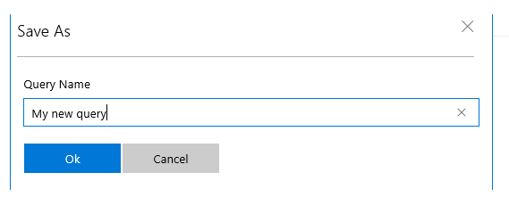

# Search and Queries

## Search

On the [All Feedback page](//developer.microsoft.com/dashboard/collaborate/feedback/bugs) in the MS Collaborate portal, you can see all work items for the engagements you have access to.  You can filter the page for specific feedback in the following ways:
-	Sort individual columns in the feedback table.
- Select specific Engagements.
-	Filter by Title.
-	Filter by work item type.

	

## How to create and save queries

There are a few kinds of queries that can be saved with an Engagement. You can open the Engagement to see the Feedback work item types and the queries available.

- **My Queries** are created by you and are visible only to you. This is a private query.
- **Shared Queries** are created by participant users in the Engagement. This query is visible to all users in the Engagement.
- **Pre-Defined Queries** are created by the *Engagement Owner* and are available to all in the Engagement. This query is available to all users but is only editable by the *Engagement Owner*.

To create queries, you must be within the context of a specific engagement.  

1. Navigate to an Engagement and click on one of the options within the Engagement page to get to the list of feedback that you want in the query.

	 

2. Click the **Advanced Filter** icon to see the fields that you can use to define the query. 

	

3. Click **Run** to return the desired query results, you can click **Save As** to add the query.

	

4. To **Edit** an existing query, navigate to the query, click the **Advanced Filter** icon and then click **Save As** to save the query as a new query.

## How to find feedback submitted by you

1. Navigate to an Engagement and click on one of the options within the Engagement page to get to the list of feedback that you want in the query.

2. Click the **Advanced Filter** icon to see the fields that you can use to define the query.

3. Click the '**+**' button to add new filter. Select **CreatedBy** from list of available fields.

4. Type **@user** in the textbox.

5. Click **Run** to return the desired query results.

