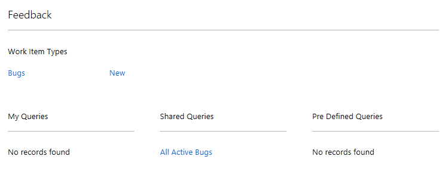
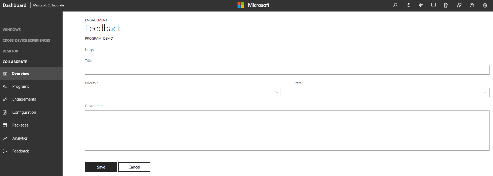

# Working with Feedback work items

Feedback work items can be bugs, feature requests, or any other form appropriate for an engagement. Each engagement can have its own customize form. The engagement also defines which organizations are going to see the feedback item.

Engagements can be:

- Two-party, between one Microsoft group and one partner. In this case, the two parties are the only ones who can see and edit a bug in this engagement.

- Multiple party, several groups and partners can collaborate on the same work item. In this scenario, an engagement might have two Microsoft organizations (Windows and Visual Studio) and three partners (an OEM, an IHV and an ODM).  When a bug is created in this engagement, all five organizations get to see and edit the same bug.

### The Universal Partner ID 

The Universal Partner ID is an ID provided by the feedback system and shared with all users of the work item.  This facilitates multi-party collaborations in which there is one common ID used by all parties.

### Legal agreement for collaboration

In collaboration engagements, a legal agreement exists between the parties in order for them to collaborate. You may be asked to accept a legal agreement when you access the engagement for the first time.  As a member of the engagement, you will be able to see the other organizations participating in the collaboration. Users can assign the bug to a specific organization to indicate the “partner on point.”

## How to view Feedback items

By default, the most recent feedback from engagements you belong to is shown on the MS Collaborate **Overview** page. 

To view feedback in the **All Feedback** page:
1.	From the Dashboard, select the **Show All** link or click **Feedback** in the left navigation.
2.	This takes you to the **All Feedback** page.
3.	Click on items in a row to open the work item.

### Search for specific feedback

On the [All Feedback page](//developer.microsoft.com/dashboard/collaborate/feedback/bugs), you can filter for specific feedback in the following ways:
1.	Sort individual columns in the feedback table.
2.	Select specific Engagements.
3.	Filter by Title.
4.	Filter by work item type.

## How to create and save queries for work items

There are a few kinds of queries that can be saved with an Engagement. You can open the Engagement to see the Feedback work item types and the queries available.

- **My Queries** are created by you and are visible only to you. This is a private query.
- **Shared Queries** are created by participant users in the Engagement. This query is visible to all users in the Engagement.
- **Pre-Defined Queries** are created by the *Engagement Owner* and are available to all in the Engagement. This query is available to all users but is only editable by the *Engagement Owner*.

To create queries, you must be within the context of a specific Engagement.  

1. Navigate to an Engagement and click on one of the options within the Engagement page to get to the list of feedback that you want in the query.

2. Click the **Advanced Filter** icon to see the fields that you can use to define the query. 

3. Click **Run** to return the desired query results, you can click **Save As** to add the query.

4. To **Edit** an existing query, navigate to the query, click the **Advanced Filter** icon and then click **Save As** to save the query as a new query.

## How to submit new feedback work items (e.g. bugs, feature requests, etc.)

All feedback work items must be associated with a specific Engagement. A work item can only be in one Engagement at a time. The Engagement determines not only who can see/edit the work item, but also determines the forms and fields available. When creating new feedback, you will need to select the appropriate Engagement.

1. Choose one of the multiple ways to create new feedback:
- From the **MS Collaborate Dashboard**, click “Add New” under the Feedback item.
- From the **All Feedback** list page, select “Submit New Feedback".
- From an **Engagement** page, select "New" next to the specific work item type.

2. Select the appropriate Engagement for the work item.

3. The “Submit Feedback” page will appear. Complete the required fields and click “Save”.

> [!NOTE]
> Fields on the **Submit Feedback** page are dependent on the Engagement selected. Engagements can customize the feedback forms as needed.
 
4.	Clicking “Save” will take you to the **Feedback List** view. Work items submitted will appear on this page. 

## How to Edit Feedback Work Items

1. Open a work item from any of the **Feedback List** pages. The **Edit Feedback** page will appear. You can edit any available fields depending on the state of the work item and the rules established for the engagement.

2. Saving the work item will sync changes for all organizations in the Engagement.

## How to export feedback to Excel

After filtering to identify the work items that you want to export, you can export the table to Excel by clicking the export arrow.

