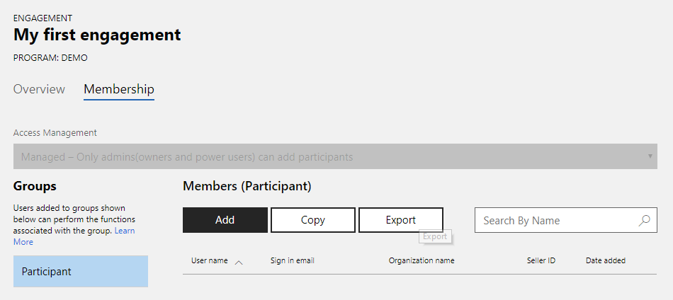
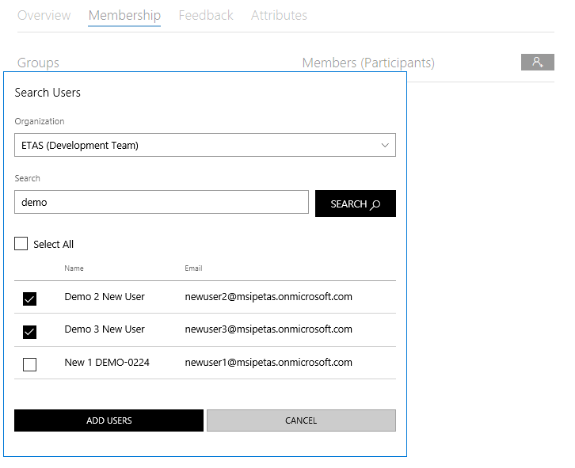
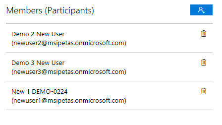

# Managing Users

The Microsoft Collaborate system uses **Engagements** to define the permissions/roles for the portal.  If you are a participant of the engagement, you can see the engagement metadata, content and feedback associated with the engagement.  The additional permissions within the engagement are defined as roles.  If you are added to a role, you can edit specific aspects of the program/engagement.  If you are not a member of the engagement, you do not see the engagement or any of its artifacts.

At this time, only Microsoft users can create and manage programs and engagements. Non-Microsoft users can use join existing engagements and manage user access for their organization.

## Roles

MS Collaborate has the following membership roles:

Role | Scope of permissions | Description
---------------- | ------------------- | ---------------------------------
**Participants** | Engagement | Users of the content and feedback associated with the engagement. Able to view engagement information and the Program landing page the engagement is part of.  Able to download content.  Able to view, edit feedback work items associated with the engagement.
**Power User** | Engagement | Organization admins who are able to manage Participants for their organization.  An organization can have multiple Power Users identified.  Only Program Owners at Microsoft can add Power Users and Power Users can only add Participants.
**Content Publisher** | Engagement | Microsoft users able to publish content packages to be downloaded by participants.  
**Engagement Owner** | Engagement | Microsoft users able to manage the engagement, including engaement metadata, membership, feedback forms, and publishing templates.  Engagement owners also inherit all other role permissions within the engagement, such as package publishing and participant user permissions.  
**Engagement Manager** | Program  | Microsoft users with permission to create engagements under a program.  Program owners can add/remove users from this role for the program.
**Program Owner** | Program | Microsoft users who can manage all aspects of the program and all engagements under the program.  

## Managing user access

Only users that exist in Partner Center account can be added to engagements. If a company or an organization does not yet exist in Partner Center, then a company representative needs to create a new company account and identify an organization admin who can add other users to the Partner Center company account. 

See [Register with Microsoft Collaborate](registration.md) for more information about getting set up to use MS Collaborate.

> [!NOTE]
> MS Collaborate uses the same account as other programs in Partner Center.  The type of account you choose is important if your company or organization plans to enroll in other Partner Center programs that require bank account or certificate information.  
> 
> If your organization uses Azure Active Directory (AAD), you need to add users from AAD tenant to the Partner Center account before they can join an engagement.
> 
> If you belong to multiple Partner Center accounts, be sure to use Collaborate with the one your organization used for Collaborate onboarding.  

## How to add users

Once a user is registered in Partner Center, it it easy for the *Engagement Owner(s)* or organization's *Power User(s)* to a add the user to an engagement.  Engagement Owners can add Power Users for an organization.  Contact the MS Collaborate Engagement Owner to be added as a Power User for your organization.

1. Navigate to the Engagement in which you want to add or remove users and click **Edit Engagement** to open the Engagement management page. As an organization Power User, you can only change membership roles for users in your organization.  All other tabs will be read only.

2. Click on the **Membership** tab and select the **Group** that you want to manage.
	a. Participants can interact with the engagement artifacts (feedback, packages).
	b. Power Users can add or remove users for the organization.
	c. Note that *Power Users* need to be explicitly added as *Participants* if the user also needs access to feedback and content for the engagement.

	

3.	Click the **Add User** icon in the **Members** section and then in the **Search Users** dialog, search to find the user(s) you want to add to the engagement.

4. From the list of users returned by search, select the users you want to add to the engagement. You can also use **Select All**.

	

5. Choose whether you would like to have an invitation mail sent to the user with a link to the engagement.

Once the user is added to the list, the user can begin accessing the engagement content and feedback.

## Troubleshooting users missing from search

An organization's Power Users can only search for users within their own organization's Partner Center account.  For Engagement Owners, if the engagement has named organizations, the search for users will be limited to users within the named organizations.

If the users are not appearing in the search results for your engagement:
- verify if users have been added to the organization’s account in Partner Center. If not, work with the **Administrator** of your organization account to add missing users. See [Add users to your Partner Center account](https://docs.microsoft.com/en-us/windows/uwp/publish/add-users-groups-and-azure-ad-applications#add-users-to-your-dev-center-account) article for the detailed instructions.
- It is possible that the organization has more than one Partner Center organization account (seller ID) in Partner Center.  Be sure the appropriate organization has been added to the engagement and that the appropriate users are in that organization.  If the organization is incorrect, please contact your Microsoft Engagement Owner.
	
## How to remove users

1.	To remove a user, select the user in the **Members** list and click the delete icon.
 
	

2.	Confirm that you want to remove the user, and the user will no longer be a member of the group.

Note that removing a user from an engagement does not impact the user's account in the Partner Center account system.  The user account will remain available for other engagements and other Partner Center programs.
