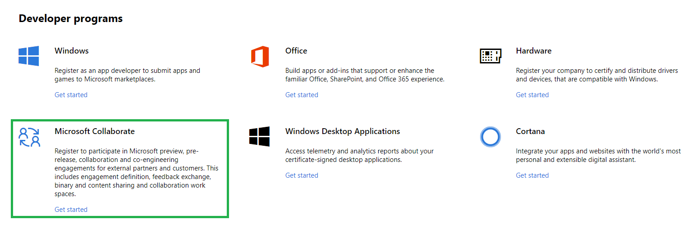
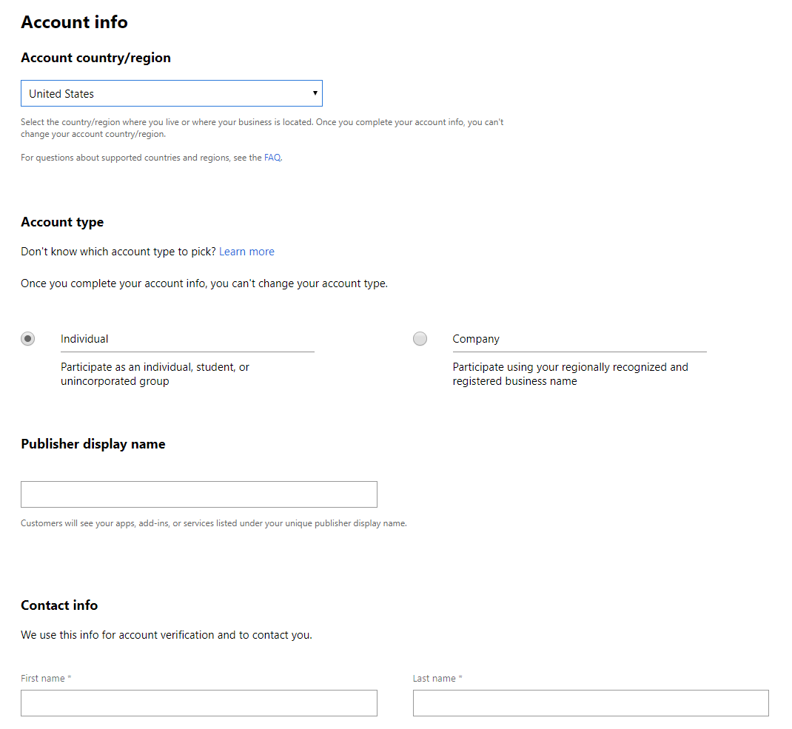

# Registration

Microsoft Collaborate program is offered through Partner Center and requires registration. If you already have an account in Partner Center it is best to use the same account to enroll in Collaborate. 

## How to register as an individual

1. Navigate to the [Partner Center Directory](https://partner.microsoft.com/en-us/dashboard/directory).
2. If you're not already signed, sign in now using existing account or create new *Microsoft Account*. 

   > [!TIP]
   >
   > * You can register using *Microsoft Account* (personal account).
   > * You can register using *Azure AD* (organizational account) if you have the *global administrator* role. If you do not have the role, you can try to [find global administrator](troubleshooting.md#how-to-find-global-administrator-for-your-organization) for your organization to help you register.
   
3. Scroll down to **Developer programs** section and click on [Get Started](https://partner.microsoft.com/en-us/dashboard/registration/collaborate) link for **Microsoft Collaborate**. 

   

4. The **Get Started** link will take you to the registraion page. 

   

   > [!NOTE]
   > If you signed in with the existing Partner Center account the page will contain information from that account. You can modify **Publisher display name** and **Contact info** if needed.
   > 
   > [!IMPORTANT]
   > The following error indicates that user is signed in with an *Azure AD* account that does not have administrator privileges and registration cannot be completed. 
   > > We could not validate your identity as a global administrator. 
   > 
   > Try to [find global administrator](troubleshooting.md#how-to-find-global-administrator-for-your-organization) for your organization or sign out and sign in again using *Microsoft Account*. 

5. Select the **Account country/region** in which you live, or where your business is located. You won't be able to change this later.
6. Select your **Account type** (individual or company). You won't be able to change this later, so be sure to choose the right type of account.
7. Enter the **Publisher display name** that you wish to use (50 characters or fewer). Select this carefully, as this name will be used when you interact with Collaborate (download content, submit feedback and etc.). For company accounts, be sure to use your organization's registered business name or trade name. Note that if you enter a name that someone else has already selected, or if it appears that someone else has the rights to use that name, we will not allow you to use that name. 

   > [!NOTE]
   > Make sure you have the rights to use the name you enter here. If someone else has trademarked or copyrighted the name you picked, your account could be closed. If someone else is using a publisher display name for which you hold the trademark or other legal right, [contact Microsoft](http://go.microsoft.com/fwlink/p/?LinkId=233777).    

8. Enter the contact info you want to use for your account.

   > [!NOTE]
   > We'll use this info to contact you about account-related matters. For example, you'll receive an email confirmation message after you complete your registration.

   If you are registering as a company, you'll also need to enter the name, email address, and phone number of the person who will approve your company's account.

9. Review your account info and confirm that everything is correct. Then, read and accept the terms and conditions of the [Collaborate Agreement](https://go.microsoft.com/fwlink/?linkid=849107). Check the box to indicate you have read and accepted these terms.

10. Click **Finish** to confirm your registration.  

## How to register as an organization

When creating a company account, we suggest that you follow these guidelines, especially if more than one person needs to access the account.

 - Create your Microsoft account using an email address that doesn't already belong to you or another individual, such as *MyCompany_PartnerCenter@outlook.com*. You may not be able to use an email address at your company's domain, especially if your company already uses Azure AD.
 - If you plan to join **Windows** program for app development in future and want to reuse your partner center account, then it is recommended that you enroll to **Windows** program first and then join **Collaborate**. Otherwise you might have to create separate accounts for these programs.
 - Add a company phone number that does not require an extension and is accessible to key team members.

## How to configure access for multiple users

You can use Azure Active Directory to add and manage additional users in your Partner Center account. 
-   [Associate Azure Active Directory with your Partner Center account](/windows/uwp/publish/associate-azure-ad-with-dev-center)

You must first associate your Partner Center account with your organization's Azure Active Directory to be able to add and manage users. 
-   [Add users, groups, and Azure AD applications to your Partner Center account](/windows/uwp/publish/add-users-groups-and-azure-ad-applications)

You can define the role or custom permissions that each user should have. 
-   [Set roles and custom permissions for account users](/windows/uwp/publish/set-custom-permissions-for-account-users)

> [!TIP]
> Partner Center leverages Azure Active Directory for multi-user management and roles assignment. If your organization already uses Office 365 or other business services from Microsoft, you already have an AAD. Otherwise, you can create a new AAD tenant from within Partner Center at no additional charge.

## How to log in to the MS Collaborate portal

1. Navigate to MS Collaborate: [https://aka.ms/collaborate](https://aka.ms/collaborate).

2.	You will be asked for credentials to log in. This is your Partner Center account credentials. If you have more than one account, select the appropriate account that you used to sign up for Partner Center. This can be a Microsoft alias account (MSA) or an Active Directory organization account. If you have not logged in before, you will need to enter your password.

3. After logging in, the Microsoft Collaborate dashboard will appear, showing you the engagements, packages, and feedback, you are configured to see. If you are not a member of any programs or engagements, the lists will be blank. You need to be added to an engagement to interact with content or feedback. 

## Next steps

Before you can download content or submit feedback, you need to join an engagement. Some engagements require invitation from Microsoft **Engagement Owner** or **Power User** (when your organization is already added to an engagement). Other engagements are **Open** for users to join.
